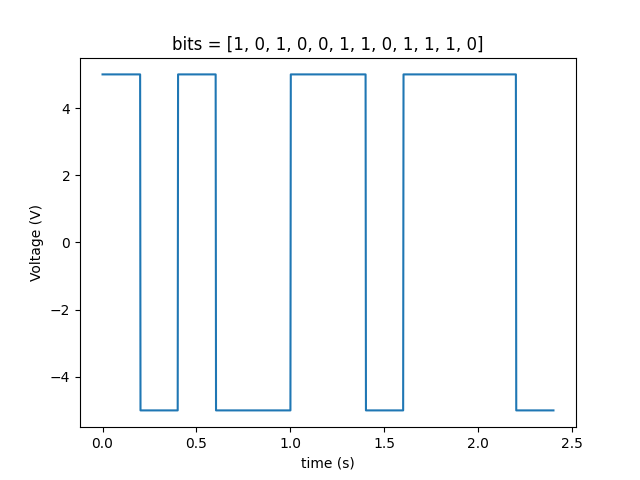
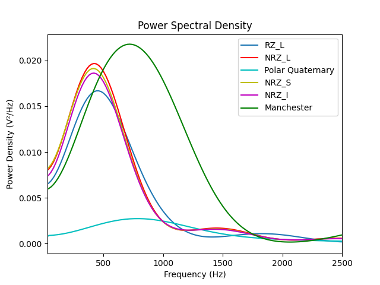
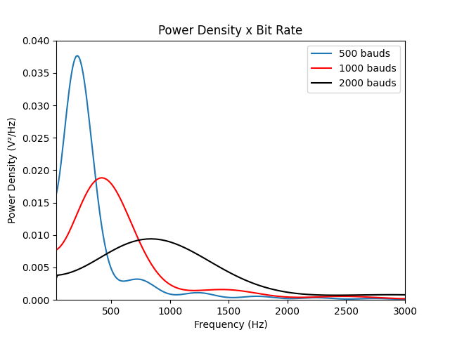

# Pulse-Amplitude modulation

  This is a personal project to implement and analyze some of the line codifications used in
  communication systems.

## Description

  In communication systems the process to send and receive a message can be
  divided basicaly in six steps:

  1. The information source: voice, text, video.
  2. Modulation: the information itself is converted to a particular format suitable for
  transmission, wave carrier, pulse sequence...
  3. The signal pass through a channel: the air (wifi), or a confined space (cable).
  4. The information is captured by a receiver.
  5. There's a detector of wave form.
  6. The information is then send to it's destination: a viewer,
  a microcontroler etc.

  Of course that exist a ton of communication protocols and recursive checks to
  make the whole thing work properly, but this project is concentrate mostly in
  the pulse modulation and demodulation.

  The codifications implemented so far:
  - Non Return to zero level [**NRZ**(**L**)]
  - Non Return to zero spacial [**NRZ**(**S**)]
  - Non Return to zero inverted [**NRZ**(**I**)]
  - Return to zero level [**RZ**(**L**)]
  - Polar quaternary
  - Manchester

  The way that the functions were made, they can be unipolar or bipolar, this
  only depends of the parameters v_min and v_max passed to the functions.

  Here's an example of the NRZ codification:
  

## Analysis

  The analysis made refers to the variance, standard deviation and power spectrum density of each codification line.
  

  Also is possible to see how the error decreases when the energy increases and
  the diference among the unipolars, bipolars and multilevel line encodings.
  

## How to start

  There's a file example ready to run the code, the file is divided in blocks,
  on each block there's a comment explaning what that particular block does.

### Python requirements

  Packages required to run the code:
  - Numpy
  - Scipy
  - Matplotlib

## To do

  - Demodulate manchester and polar quaternary line encoders
  - Improve the charts
